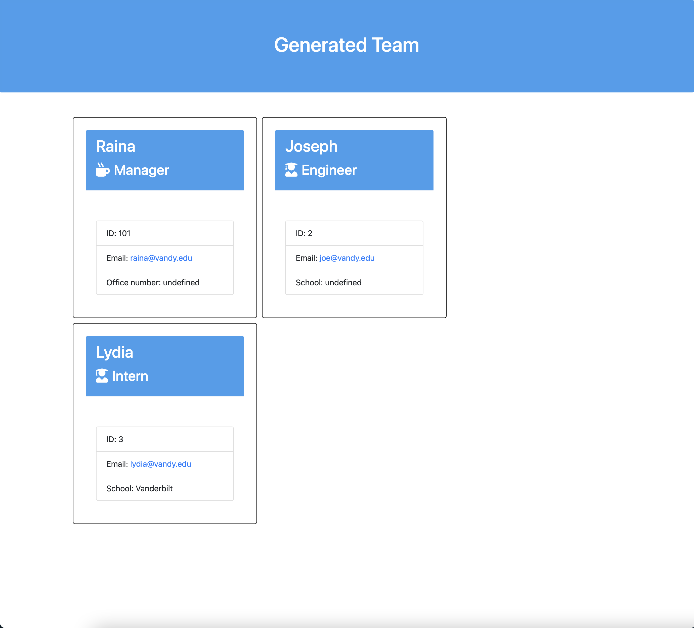

# team-profile-generator-2

## Introduction

Create a web page that lists the people in your team. Use this command-line application to generate an HTML file that's ready to use for your website.

## Installation

**Node.js** is required in order to run this script.

1. Download or clone this repository into your local computer.
2. In your terminal, browse to the folder and run `npm install`.

## Usage

1. In your terminal, run the script with the command `node ./app`.
2. Enter your answers when prompted.
3. After all members have been added, your HTML will be generated in the `output/team.html` folder.

Walkthrough video that demonstrates functionality:
https://www.youtube.com/watch?v=BHN8WzrmLKs&feature=youtu.be

## Example

